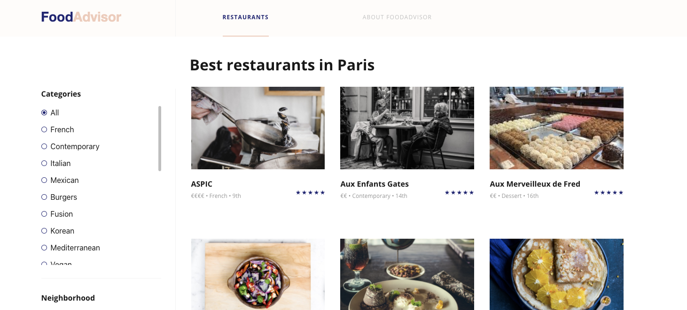

  

  <h1 align="center">Next steps</h1>

## If there's time

You will notice that the production site does not have images. This is partially due to the quality of the database dump I created (nice one), but it does provide an opportunity to explore how data works on Platform.sh. 

1. Go to your `master` environment, log into your Admin account, and go to the `Restaurants` collection. 
2. There are 5 restaurants, each associated with the same image. Replace that image with one from `strapi/scripts/images`. After you save all of the restaurants should update.  
3. Update the frontend consuming Strapi by running `platform environment:redeploy -e master`.
4. After redeployment, you'll see those images now on the frontend. 
5. Visit your `frontend` environment. Still no images there. 
6. Run `platform sync -e frontend data` to get a fresh copy of production data. You can perform this action at any time on your development environments.

## Conclusion

Congrats! You've completed the workshop. Together we've deployed Strapi's FoodAdvisor demo to Platform.sh. From this point you can customize your application in additional development environments to deliver your own decoupled Strapi-powered site.

## Considerations

- Keeping your work: [setting up an integration](https://docs.platform.sh/integrations/source.html)
- Strapi development servers, and write access
- Editorial workflows and the flow of data on Platform.sh
- Lifecycle hooks & Gatsby Live Preview/Incremental builds

## Bonus!

Not satisfied with how the data ends up looking on the final production site? Me neither! 

    

Branch a new environment off of `master` and go through the [multi-app configuration steps](05-multi-app.md) to see the complete site using SQLite. 

## Additional resources

- [Platform.sh site](https://platform.sh/marketplace/strapi/)
- [Platform.sh public documentation](https://docs.platform.sh)
- [Platform.sh API documentation](https://api.platform.sh/docs)
- [The original FoodAdvisor repository](https://github.com/strapi/foodadvisor)
- [The standard Platform.sh template](https://github.com/platformsh-templates/strapi)
- [Strapi backend, Eleventy frontend Platform.sh multi-app template](https://github.com/platformsh-templates/eleventy-strapi)
- [Strapi backend, Gatsby frontend Platform.sh multi-app template](https://github.com/platformsh-templates/gatsby-strapi)
- Docs: [Strapi backend](https://docs.platform.sh/guides/gatsby/headless/strapi.html) and [Gatsby frontend](https://docs.platform.sh/guides/gatsby/deploy.html) in-detail guides
- [Deploy Friday livestream: E02 Gatsby & headless CMS, including Strapi, Drupal, and Oracle Content & Experience](https://www.youtube.com/watch?v=H1WNHVXJiUg) with Pierre Burgy
